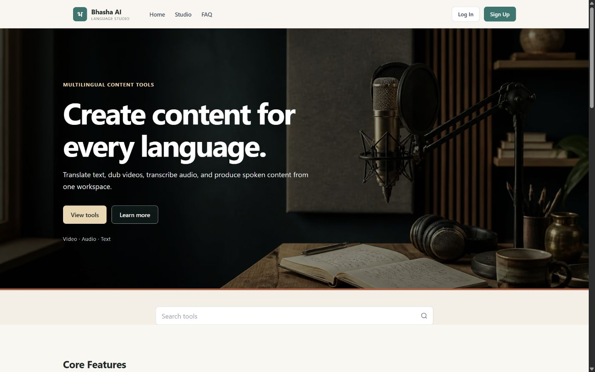
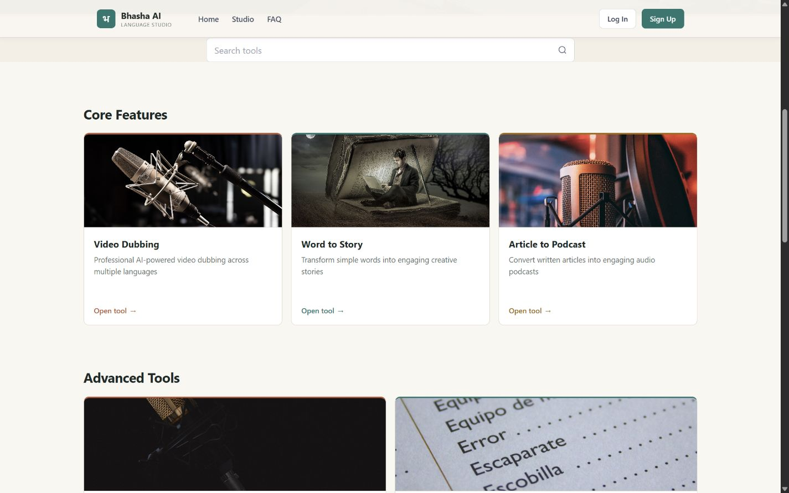

# Bhasha AI

Bhasha AI is a multilingual media workspace for translating text, dubbing video, transcribing audio, generating spoken content, and turning ideas into stories and podcasts.



## Tools

- Video dubbing across multiple languages
- Word-to-story generation
- Article-to-podcast conversion
- Speech-to-text transcription
- Context-aware text translation



## Technology

- React 19 and Vite frontend
- Flask REST API
- SQLite with SQLAlchemy
- JWT authentication
- Google Gemini and ElevenLabs integrations

## Run locally

Create a `.env` file in the project root:

```env
ELEVENLABS_API_KEY=your_key
GEMINI_API_KEY=your_key
JWT_SECRET_KEY=replace_with_a_random_secret
```

Start the backend:

```powershell
uv sync
uv run python backend.py
```

In another terminal, start the frontend:

```powershell
cd frontend
npm install
npm run dev -- --host 0.0.0.0 --port 5000
```

Open [http://localhost:5000](http://localhost:5000). The backend health endpoint is available at `http://localhost:5001/api/health`.

## Validation

Frontend quality checks:

```powershell
cd frontend
npm run lint
npm run build
```

See [METRICS.md](METRICS.md) for the current evaluation and performance results.
